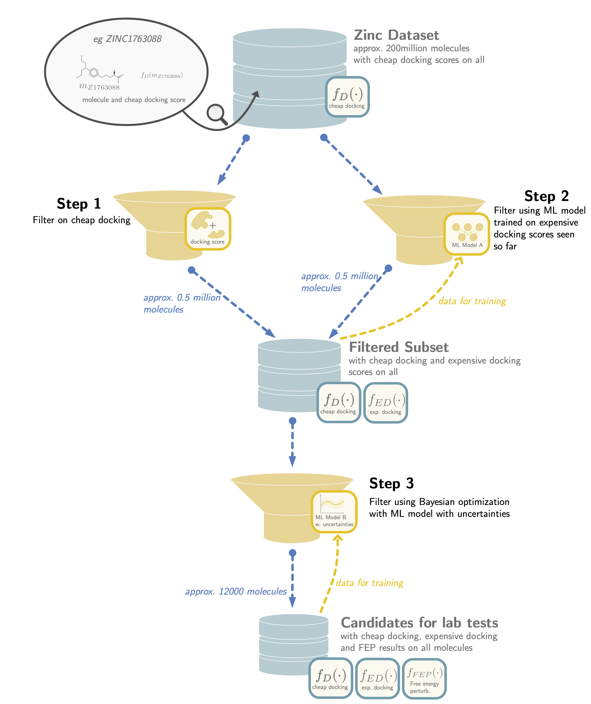
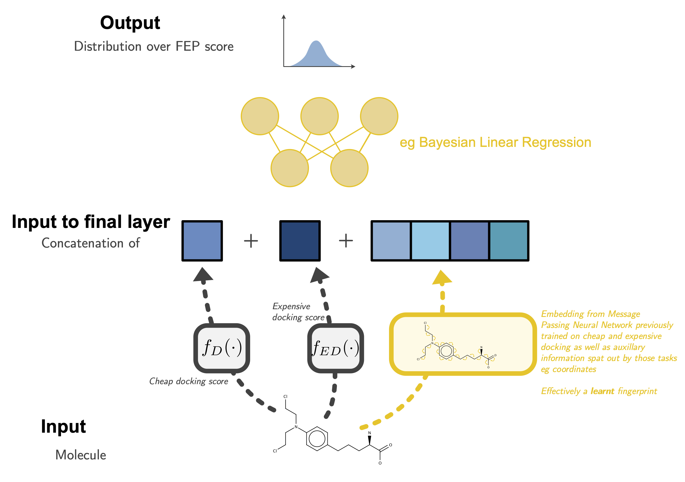

# Bayes Virtual Screening

## Overview
See [the overview notes](notes/overview/compiled_drafts/13_may_2020.pdf) for a broad discussion of task.
There is also this [GoogleDoc](https://docs.google.com/document/d/1zx9na64Qt2_11BjoqQiXiyANT-O4ZTXPOTdPA3fsZLM/edit#) 
from the first meeting.  
__**todo:**__ I believe there are more notes than this on some other Google Doc. Find out where they are and reference them here. 

### Very Brief Recap (see notes above for more details)
We have a series of oracles with increasing cost but with increasing fidelity. These are called cheap docking (~15 secs),
expensive docking (~8 min) and FEP (1 day on special hardware). In a traditional [virtual screen](https://en.wikipedia.org/wiki/Virtual_screening),
the best results from the cheaper oracles are sent to the more expensive oracles. This project is interested in how ML 
could speed up/improve this process by using machine models to try to learn and correct the mistakes of previous oracles.
In particular we are interested in using Bayesian Optimization to decide on which molecules to send to the most expensive
oracle, FEP (ie treat it as a contextual bandit problem). 

## Installation/Requirements
Using [Anaconda](https://www.anaconda.com/products/individual) to manage packages.

You can setup the environment by running:
`conda env create -f conda_env.yml`

And then activate it by:
` conda activate py37_bayesvs`

## Dummy Problem

Currently we are setting up a dummy problem to represent the task above (to make sure various pipelines work and to tune 
choice of models etc). 
This dummy task is based on the cheap docking data from a different task (docking to D4 Dopamine receptor). 
In our mocked up task this cheap docking data counts as the ground truth.
To create results for cheap docking/expensive docking/FEP oracles for our mocked up task we are adding
 the outputs of randomly initialized NNs (after tuning so that they have suitable variances) to our "ground truth" values.

Note this is still very much a work in progress.
Below we describe how to run the code written so far and then go through all the todos!

### How to Run

First download the Dopamine dock scores from https://github.com/MKorablyov/brutal_dock/tree/master/d4/raw.

#### Creating the Dummy Oracles
1. Run `scripts/fit_dummy_oracles.py` to fit the oracles (modify the `Params` class in this script with the location of
the docking files).
Alternatively you can download the oracles that I created and have put in
 [Google Drive](https://drive.google.com/drive/folders/14eHJSe2tFWQi3ZTCYGcuu4GVPJ7feUam?usp=sharing).

2. (optional) Run `JupyterNotebook/StructuredNoise.ipynb` to look at the distribution of the noises (ie just checking
that step 1 worked correctly.)

#### Running the Screening.

1. Run `scripts/run_vs.py` to run the virtual screening code -- this is still work in progress as the Bayesian model 
is only a single layer.

2. Analyze the results using JupyterNotebooks/VS.ipynb. 
Again I don't think it is fully decided on what is the best benchmark to check.

## Todos

**todo:** please add to this!

#### 1 BayesOpt

In no particular order:

##### 1.1 Tune the setup, use more representative values for batch size etc
Also should decide on how we want to evaluate.
 

##### 1.2 ✅ Add in the previous (more noisy oracles) output in as features to ML models
 

##### 1.3 Decide on how best to benchmark how well an acquisition scheme works
Ie are we going to look at final best molecule found or choose some measure of regret
 

##### 1.4  Consider using the original Dopamine dataset
The dataset we are using is a subset of Dopamine, sampled so that we have a uniform distribution over Dock6 scores.
This means that randomly we may find a good point with more chance than the original dataset which had a longer tail.
 

##### ✅ 1.5 Explore prior tuning/hyperpriors for Bayes Regression
On Bayes Learning call 13.May we discussed tuning the parameters over the noise and weights distribution to learn them
or potentially using hyperpriors.
This is important as in low data regimes the model is not performing well.
The notebooks `JupyterNotebooks/BayesModelFP.ipynb` and `JupyterNotebooks/BayesianModel1dDemo.ipynb` may be useful 
for this task. Would be good to add log likelihood to the first notebook.
 

**Update 19 May** _done using Sklearn Bayesian regression for now but could do it fully in Pytorch later on_

##### ✅ 1.6 Change the Bayesian Regression sampling so that can sample first from weights then batch.
At the moment the Gaussian posterior uncertainty over weights is propagated through predictions which return a MVN distribution
over the predicted points. This will not be amenable to larger datasets.
 

##### 1.7 Add random and greedy acquisition function baselines.
 

##### 1.8 Explore different likelihoods
eg the likelihood suggested by Bianca 13.May http://web.mit.edu/dubeya/www/files/alphats_ijcai19.pdf
If the model becomes intractable we can always use Pyro for sampling or VI.
 

##### 1.9 Explore mean function
Consider the mean function here: https://arxiv.org/pdf/1502.05700.pdf
 

##### 1.10 Code up step 2
In the overview figure above we have a stage where we go back and use a ML model to find more examples from cheap docking
to suggest for expensive docking. This is not currently implemented.
 

#####  1.11 Match the APIs being discussed for RECOVER
This task also will be using Active Learning/Bayes Opt and so if we match the APIs here with those there we can reuse much
of the Bayesian models/acquisition function parts if we want.
 

 
 

#### 2 Engineering

These are mostly problems for scaling the process up for the larger ZINC dataset, once we are happy with the performance
and models in the dummy problem, hence perhaps for addressing later.

##### 2.1 Interacting with oracles
How do we communicate with an oracle to set off a batch of expensive docking simulations for example.
 

##### 2.2 Parallelising
On the large dataset when running the acquisition function we may want to run it in parallel if querying over a large
number of candidate molecules.
 

##### 2.3 Dealing with versionable datasets
In stage 2 (diagram above) we will have a feedback loop which trains a ML model, collects data and then retrains the model
based on this new data. We need a way to record the different versions of this data so that we know which the ML model
has already seen.
 

 
 

#### 3 Feature Representation

##### 3.1 Talk to feature representation team so that they understand our problem
At the moment we are getting graph level representations of molecules using Morgan fingerprints. Longer term we want
to feed into our models learnt embeddings (eg from a trained MPNN), see image below. Perhaps need to discuss how best to do this.

