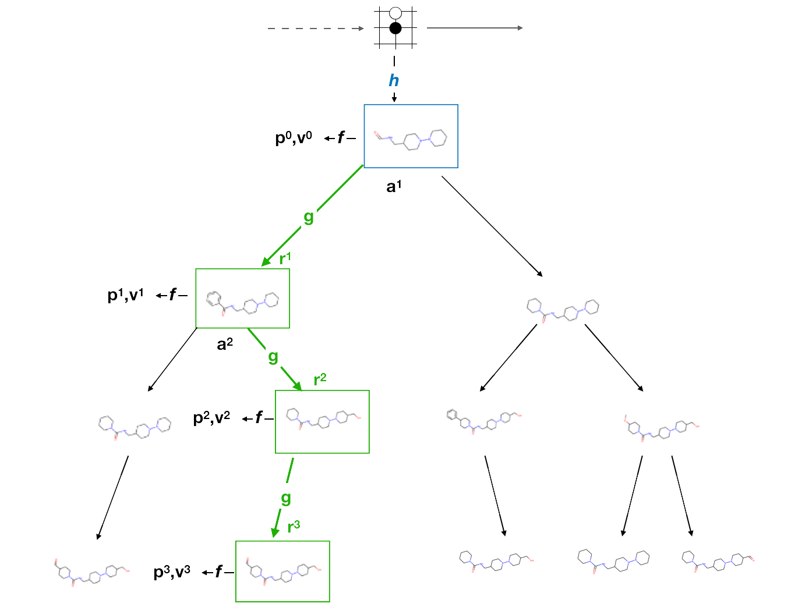

# LambdaZero: search in the space of small molecules

## Install
Install anaconda: [miniconda](https://docs.conda.io/en/latest/miniconda.html)
```
conda env create -f environment-linux.yml [-n env_name]
```
This will create an environment named `lz`. 
LambdaZero depends on external programs (such as Dock6 and UCSF Chimera) and datasets (brutal dock and fragdb etc. ) that are not provided in this repo. These could be installed by running:

```
bash install-prog-datasets.sh [-d dataset_path] [-p programs_path] [-s summaries_path]
```
this script would create a locator file called `external_dirs.cfg` that is machine specific and is used by the LambdaZero core to be able to call external dependencies. 


## Getting started
Run a few RL algorithms
`cd examples`
run ppo
```
python train_molecule.py ppo001
# you should see something like this

#+-----------------------------+----------+--------------------+-----------+------------------+------+--------+
#| Trial name                  | status   | loc                |    reward |   total time (s) |   ts |   iter |
#|-----------------------------+----------+--------------------+-----------+------------------+------+--------|
#| PPO_BlockMolEnv_v3_4e681962 | RUNNING  | 192.168.2.216:4735 | -0.582411 |          27.1576 | 4000 |      1 |
#+-----------------------------+----------+--------------------+-----------+------------------+------+--------+

...


```

Run Ape-X
```
python train_molecule.py apex001
```

Run AlphaZero
```
# az000 ending by three zeros means it is a debug configuration
# in case of AlphaZero, it means expanding MCTS only a few times to see the outpus
python train_molecule.py az000
```

Run Docking simulation in parallel

Train MPNN on simulation data

For more information see tutorials, and docs

## Getting Involved
 Google group
 Slack community
 Meetings schedule


## References
- AlphaZero: https://arxiv.org/abs/1712.01815
- Ranked rewards: https://arxiv.org/abs/1807.01672


